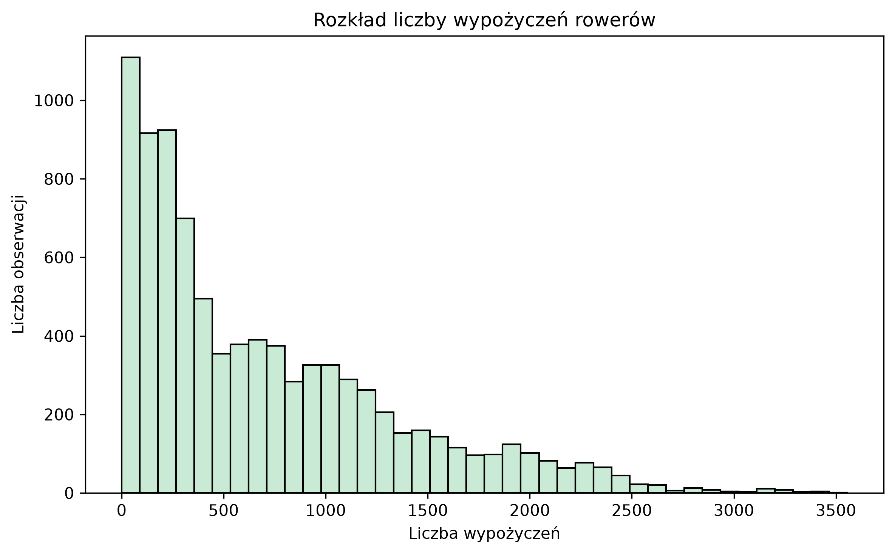
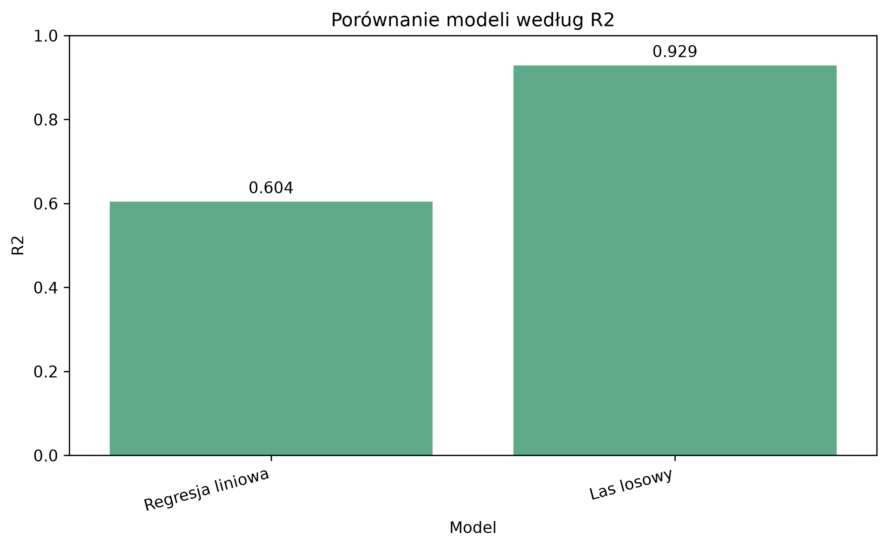

# Bike Sharing Demand Forecasting

## Opis projektu

Celem projektu jest przewidywanie liczby wypożyczeń rowerów miejskich na podstawie danych pogodowych, sezonowych i czasowych.

W projekcie analizuję, jak czynniki takie jak godzina, temperatura, wilgotność, opady deszczu oraz pora roku  wpływają na liczbę wypożyczeń rowerów.

Zmienną przewidywaną jest `Rented_Bike_Count`, czyli liczba wypożyczonych rowerów.

## Zbiór danych

Dane pochodzą ze zbioru "Seoul Bike Sharing Demand" dostępnego na Kaggle.

Początkowo zbiór danych zawierał:

- 8760 obserwacji,
- 14 kolumn,
- dane pogodowe, czasowe i informacje o działaniu systemu.

Przykładowe cechy w danych:

- data,
- godzina,
- temperatura,
- wilgotność,
- prędkość wiatru,
- widoczność,
- promieniowanie słoneczne,
- opady deszczu,
- opady śniegu,
- pora roku,
- święto,
- informacja, czy system działał.

## Cel analizy

Celem projektu było:

- wczytanie i sprawdzenie danych,
- oczyszczenie nazw kolumn,
- przygotowanie nowych cech,
- analiza zależności między pogodą, czasem i liczbą wypożyczeń,
- zbudowanie modeli regresyjnych,
- porównanie wyników modeli,
- sprawdzenie najważniejszych cech dla najlepszego modelu.

## Użyte technologie

W projekcie wykorzystałam:

- Python,
- pandas,
- numpy,
- matplotlib,
- seaborn,
- scikit-learn,
- joblib.

## Przygotowanie danych

W pierwszym kroku dane zostały wczytane i sprawdzone pod kątem brakujących wartości oraz duplikatów.

Nazwy kolumn zostały uproszczone, aby łatwiej pracować z nimi w Pythonie.

Po czyszczeniu danych zbiór zawierał:

- 8760 obserwacji,
- 14 kolumn.

## Tworzenie nowych cech

Na podstawie kolumny z datą zostały utworzone dodatkowe cechy:

- rok,
- miesiąc,
- dzień,
- dzień tygodnia,
- informacja, czy dzień był weekendem.

Dodatkowo zostały utworzone cechy związane z godzinami większego ruchu:

- `IsMorningPeak`,
- `IsEveningPeak`.

Po dodaniu nowych cech dataset zawierał:

- 8760 obserwacji,
- 20 kolumn.

## Eksploracyjna analiza danych

W analizie sprawdziłam m.in.:

- rozkład liczby wypożyczeń,
- średnią liczbę wypożyczeń według godziny,
- średnią liczbę wypożyczeń według pory roku,
- zależność między temperaturą a liczbą wypożyczeń,
- wpływ działania systemu na liczbę wypożyczeń.

### Rozkład liczby wypożyczeń

Większość obserwacji dotyczy niższej lub średniej liczby wypożyczeń, ale w danych występują też dni i godziny z bardzo dużym popytem.

### Średnia liczba wypożyczeń według godziny

Liczba wypożyczeń zmienia się w zależności od godziny. Widać wyraźne różnice między godzinami nocnymi, dziennymi i wieczornymi.

### Średnia liczba wypożyczeń według pory roku

Pora roku ma widoczny wpływ na liczbę wypożyczeń. W cieplejszych okresach rowery są wypożyczane częściej.

### Temperatura a liczba wypożyczeń

Wraz ze wzrostem temperatury liczba wypożyczeń zwykle rośnie, chociaż zależność nie jest idealnie liniowa.

## Modelowanie

Do przewidywania liczby wypożyczeń rowerów wykorzystałam dwa modele regresyjne:

- regresję liniową,
- las losowy.

Zmienną przewidywaną była kolumna:

- `Rented_Bike_Count`

Dane zostały podzielone na zbiór treningowy i testowy.

## Wyniki modeli

| Model | MAE | RMSE | R² |
|---|---:|---:|---:|
| Regresja liniowa | 310.80 | 406.04 | 0.6043 |
| Las losowy | 98.48 | 172.34 | 0.9287 |

Najlepszy wynik uzyskał model **lasu losowego**.

Model lasu losowego osiągnął wynik R² równy **0.9287**, co oznacza, że bardzo dobrze przewidywał liczbę wypożyczeń rowerów w danych testowych.

### Porównanie modeli według R²

## Wartości rzeczywiste a przewidywane

Na wykresie można porównać rzeczywistą liczbę wypożyczeń z wartościami przewidywanymi przez model.

Im bliżej punkty znajdują się linii przerywanej, tym lepiej model przewidział wynik.

## Najważniejsze cechy modelu

Dla modelu lasu losowego sprawdziłam ważność cech.

Najważniejsze cechy to głównie:

- temperatura,
- godzina,
- informacja o działaniu systemu,
- promieniowanie słoneczne,
- wilgotność,
- opady deszczu,
- szczyt wieczorny.

Wyniki sugerują, że model najczęściej korzystał z informacji związanych z pogodą, godziną oraz dostępnością systemu rowerowego.

## Wnioski

Na podstawie analizy można zauważyć, że:

- liczba wypożyczeń rowerów zależy od godziny,
- temperatura jest jedną z najważniejszych cech wpływających na popyt,
- w cieplejszych porach roku rowery są wypożyczane częściej,
- działanie systemu ma duże znaczenie dla liczby wypożyczeń,
- las losowy uzyskał dużo lepszy wynik niż regresja liniowa,
- model dobrze przewidywał liczbę wypożyczeń na danych testowych.

Model został zbudowany na podstawie jednego zbioru danych, dlatego wyniki mogą nie przenosić się bezpośrednio na inne miasta lub inne systemy rowerów miejskich.

W projekcie nie uwzględniono wielu dodatkowych czynników, które mogłyby wpływać na liczbę wypożyczeń, np. wydarzeń miejskich, awarii systemu, cen, dostępności rowerów na stacjach czy dokładnej lokalizacji wypożyczeń.

