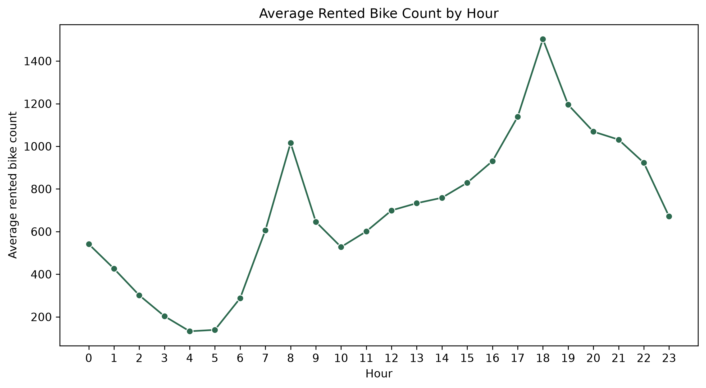
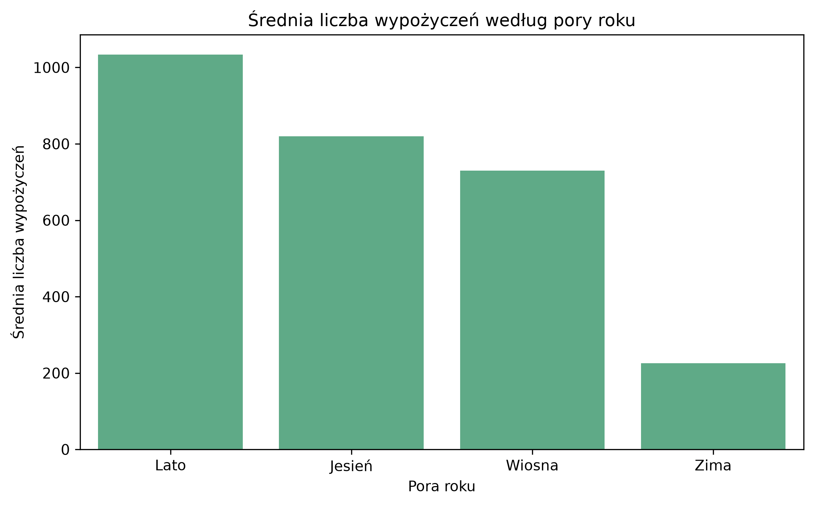
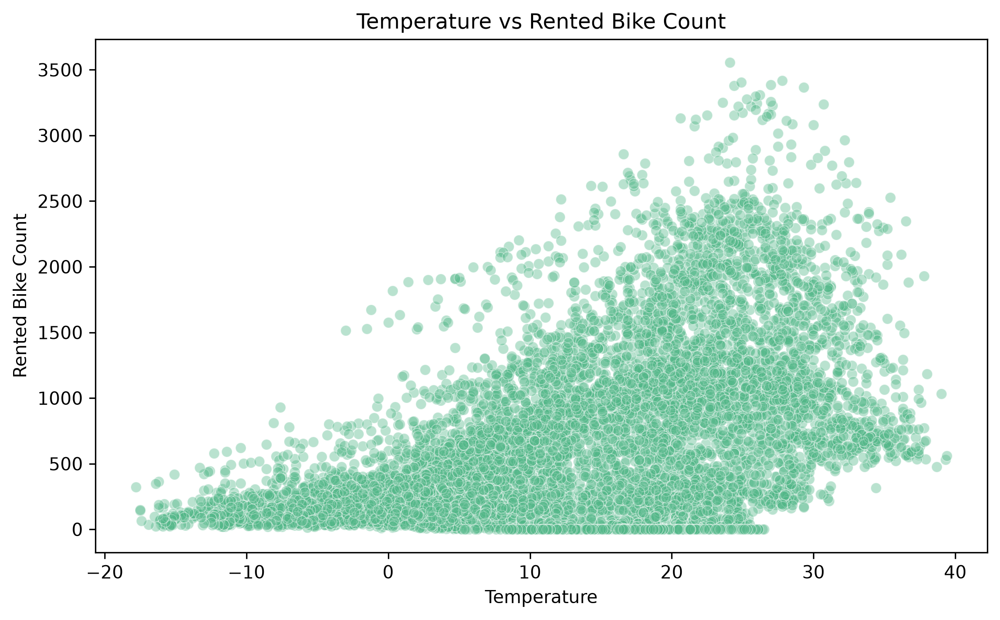
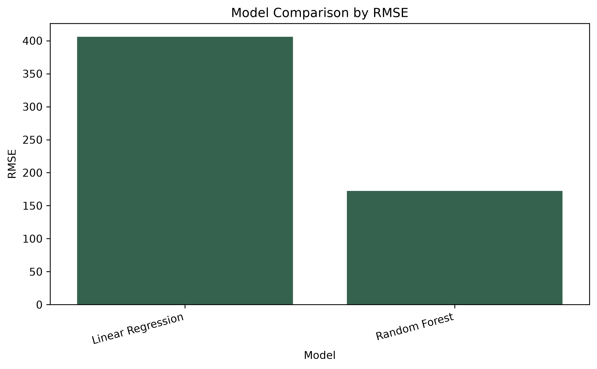
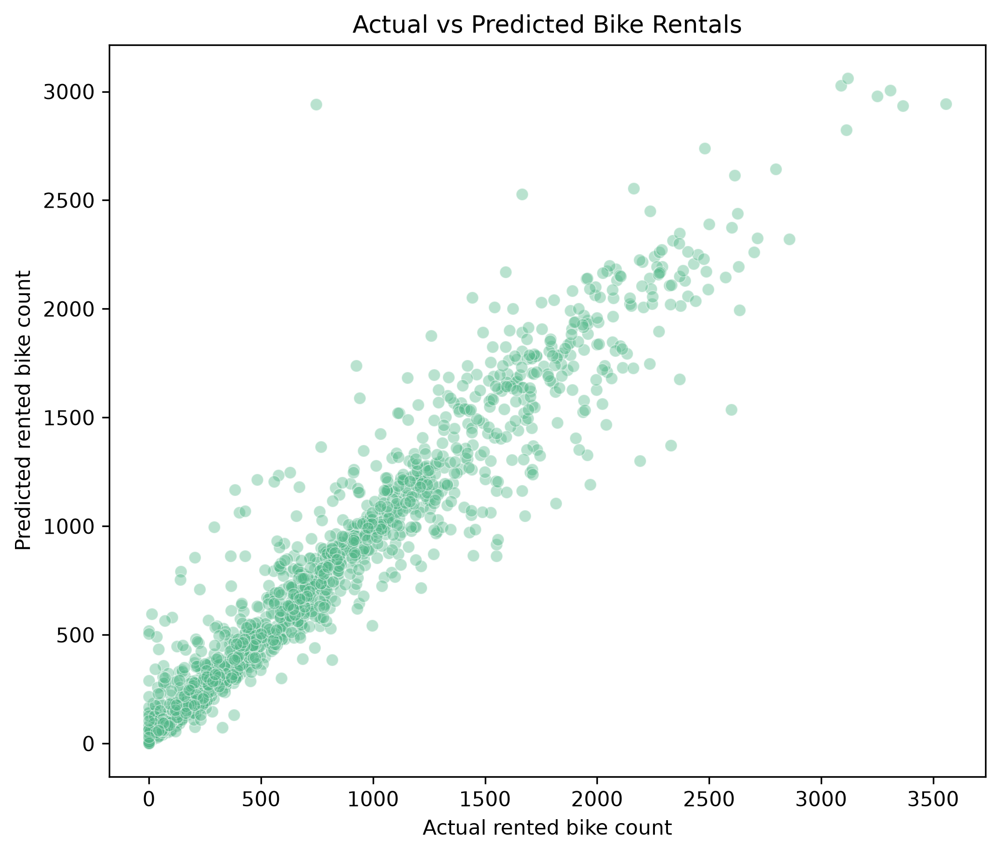
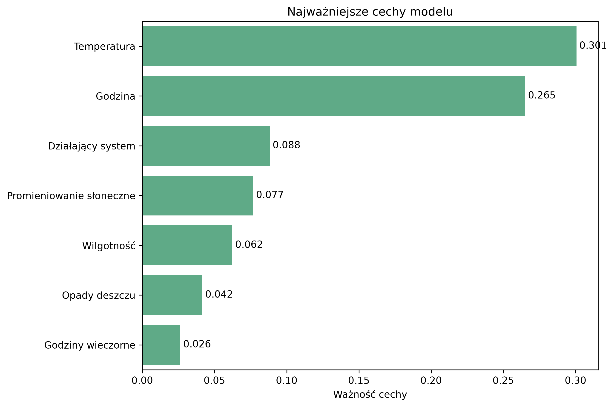

# Bike Sharing Demand Forecasting

## Opis projektu

Celem projektu jest przewidywanie liczby wypożyczeń rowerów miejskich na podstawie danych czasowych i pogodowych.

W projekcie analizuję, jak czynniki takie jak godzina, temperatura, wilgotność, opady, pora roku i dzień działania systemu wpływają na liczbę wypożyczonych rowerów.

Projekt ma charakter predykcyjny. Zmienną przewidywaną jest liczba wypożyczonych rowerów w danej godzinie.

## Zbiór danych

Dane pochodzą ze zbioru  **Seoul Bike Sharing Demand**.

Zbiór danych zawiera:

- 8760 obserwacji,
- 14 początkowych kolumn,
- dane godzinowe,
- informacje o pogodzie, porze roku, świętach oraz działaniu systemu rowerowego.

Zmienna przewidywana:

- `Rented Bike Count`

## Cel analizy

Celem projektu było:

- przygotowanie danych do modelowania,
- analiza czynników wpływających na liczbę wypożyczeń,
- stworzenie nowych cech czasowych,
- porównanie dwóch modeli regresyjnych,
- ocena jakości predykcji,
- sprawdzenie, które cechy były najważniejsze dla najlepszego modelu.

## Użyte technologie

W projekcie wykorzystałam:

- Python,
- pandas,
- numpy,
- matplotlib,
- seaborn,
- scikit-learn,
- joblib.

## Struktura projektu

W repozytorium znajdują się:

- `src/` – pliki z kodem,
- `images/` – wykresy,
- `README.md` – opis projektu,
- `requirements.txt` – lista bibliotek.

## Przygotowanie danych

W pierwszym etapie dane zostały wczytane i sprawdzone pod kątem brakujących wartości oraz duplikatów.
Po czyszczeniu danych uprościłam nazwy kolumn, aby łatwiej pracować z nimi w Pythonie.

## Tworzenie nowych cech

Do danych dodałam kilka nowych cech czasowych:

- `Year`
- `Month`
- `Day`
- `DayOfWeek`
- `IsWeekend`
- `IsMorningPeak`
- `IsEveningPeak`

Dzięki temu model mógł lepiej uwzględnić sezonowość, dni tygodnia oraz godziny szczytu.

## Eksploracyjna analiza danych

W analizie sprawdziłam m.in. rozkład liczby wypożyczeń, średnią liczbę wypożyczeń w zależności od godziny, pory roku oraz temperatury.

### Średnia liczba wypożyczeń według godziny

### Średnia liczba wypożyczeń według pory roku

### Temperatura a liczba wypożyczeń

## Modelowanie

Do przewidywania liczby wypożyczonych rowerów wykorzystałam dwa modele regresyjne:

- regresję liniową,
- las losowy.

Dane zostały podzielone na zbiór treningowy i testowy w proporcji 80/20.

Jako metryki wykorzystałam:

- MAE,
- RMSE,
- R2.

## Wyniki modeli

| Model | MAE | RMSE | R2 |
|---|---:|---:|---:|
| Regresja liniowa | 310.80 | 406.04 | 0.6043 |
| Las losowy | 98.48 | 172.34 | 0.9287 |

Najlepszy wynik uzyskał model **lasu losowego**.

Model lasu losowego miał dużo niższy błąd RMSE i wyższy wynik R2 niż regresja liniowa.

### Porównanie modeli

### Wartości rzeczywiste a przewidywane

## Najważniejsze cechy

Dla najlepszego modelu sprawdziłam ważność cech.

Największe znaczenie miały:

- `TemperatureC`
- `Hour`
- `Functioning_Day_Yes`
- `Solar_Radiation_MJ_m2`
- `Humiditypercent`
- `Rainfallmm`

Oznacza to, że liczba wypożyczeń była najmocniej związana z temperaturą, godziną dnia, działaniem systemu oraz warunkami pogodowymi.

## Wnioski

Na podstawie projektu można zauważyć, że:

- liczba wypożyczeń rowerów zależy mocno od godziny dnia,
- temperatura była najważniejszą cechą dla modelu,
- warunki pogodowe miały duży wpływ na liczbę wypożyczeń,
- las losowy poradził sobie dużo lepiej niż regresja liniowa,
- dodanie cech czasowych poprawiło modelowanie i pozwoliło lepiej opisać dane.

## Ograniczenia projektu

Model został zbudowany na danych z jednego miasta i jednego okresu, dlatego nie powinien być bezpośrednio przenoszony na inne miasta bez dodatkowej analizy.

Na wyniki mogą wpływać też czynniki, których nie ma w danych, np. wydarzenia miejskie, zmiany w transporcie publicznym lub lokalizacja stacji rowerowych.

